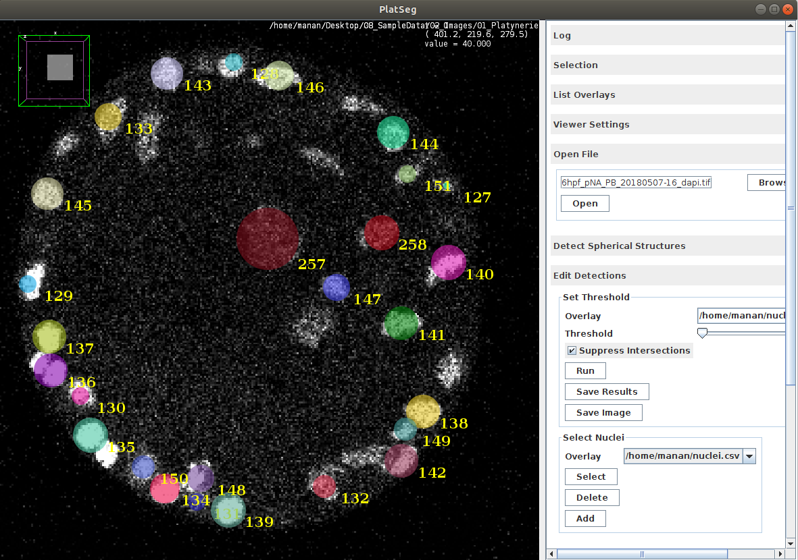

Detecting Nuclei
==================

Open Image
^^^^^^^^^^^^^^
* Select card *Open File*
* *Browse* for Image on your local workstation
* *Open* the selected file

.. image:: images/open_file.png
   :width: 600

| CTRL+SHIFT allows you to *Zoom In and Out*
| *Mouse Scroll Wheel* allows you to scroll through volumetric image

Local Minima in the 4D space
^^^^^^^^^^^^^^^^^^^^^^^^^^^^^^^
* Select card *Detect Spherical Structures*
* Set *Min Scale* =  5
* Set *Step Scale* = 1
* Set *Max Scale* =  9
* Set *Anisotropic Axis* = X for *in-situ* embryo and Z for *live* embryo
* Set *Anisotropic Sampling Factor* = 1 for *in-situ* embryo and 5 for *live* embryo
* Ensure *Bright Blobs* checkbox is ticked
* Press *Run*

| *Warning* This step above takes the most time and memory.
| If the above process fails, increase the memory allocated to Fiji by going to *Edit>Options>Memory & Threads* and increasing the *Maximum Memory*

| *Trouble Shoot* If the above doesn't work, try cropping out the background from the volumetric image just to process the embryo of interest

.. image:: images/detect_nuclei.png
   :width: 600

Edit Nuclei
^^^^^^^^^^^^^^^
* Select card *Edit Detections*
* Press *Run*
* Visually inspect the results
* At sites of over-detection, select card *Select Nuclei*
* Click on over-segmented detection and press *Delete*
* At sites of under-detection, select card *Select Nuclei*
* Drag,  form an Oval and release. Next click *Add*
* When satisfied, press *Save Results*

.. image:: images/add_nucleus.png
   :width: 600

Load Previous Detections
^^^^^^^^^^^^^^^^^^^^^^^^^^
* Open Image by using the card *Open File*
* Select card *Load Ground Truth Detections*
* Browse for previously saved *csv* results file
* Click *Open* to load results file

